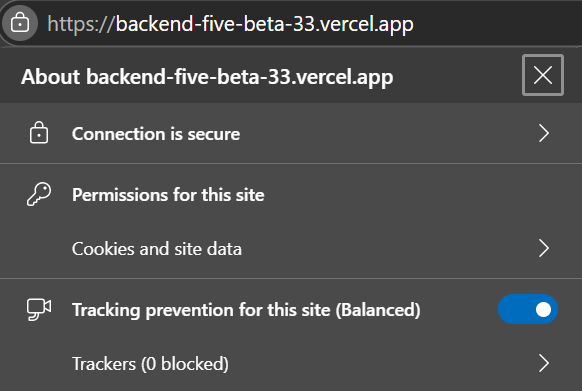
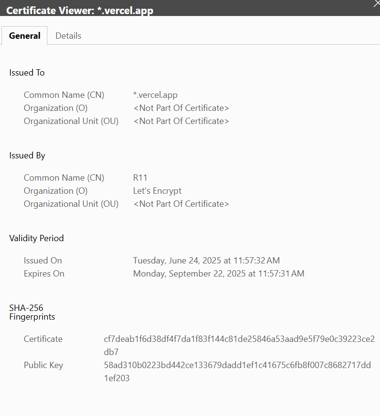
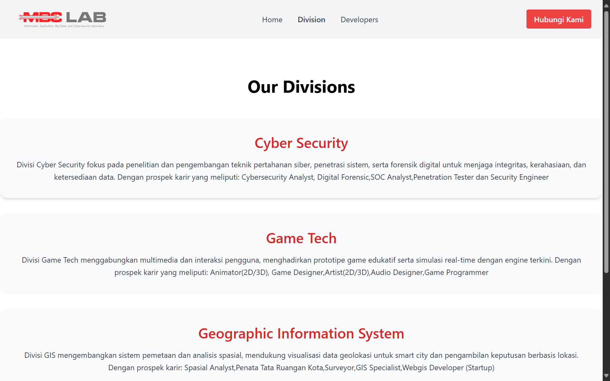

<p align="center">
  
</p>

# MBC Laboratory Website by Veiron Vaya Yarief

# [<-- Back to language choose](../../Readme.md)
# Table of Contents
- [MBC Laboratory Website by Veiron Vaya Yarief](#mbc-laboratory-website-by-veiron-vaya-yarief)
- [\<-- Back to language choose](#---back-to-language-choose)
- [Table of Contents](#table-of-contents)
  - [1. Project Structure](#1-project-structure)
  - [2. Access (Cloud \& Local) Tutorial](#2-access-cloud--local-tutorial)
    - [2.1. Cloud](#21-cloud)
    - [2.2. Local Installation](#22-local-installation)
  - [3. Website Architecture](#3-website-architecture)
  - [4. SSL Configuration and Backend](#4-ssl-configuration-and-backend)
    - [4.1. Backend Secure](#41-backend-secure)
    - [4.2. Frontend Secure](#42-frontend-secure)
    - [4.3. Explanation](#43-explanation)
  - [5. Feature (Contact Form)](#5-feature-contact-form)
    - [Example Flow](#example-flow)
  - [6. IDS Configuration \& Security](#6-ids-configuration--security)
    - [6.1. ids-rules.json](#61-ids-rulesjson)
    - [6.2. ids.config.js](#62-idsconfigjs)
    - [6.3. api/contact.js (IDS Scanning)](#63-apicontactjs-ids-scanning)
  - [7. View](#7-view)
    - [7.1. Desktop](#71-desktop)
    - [7.2. Mobile](#72-mobile)
    - [7.3 Success](#73-success)


## 1. Project Structure

```
MBC_LABORATORY_WEBSITE/
├── backend/
│   ├── api/                         # Vercel auto read “api”
│   ├── .env                         # Environment variables for backend
│   ├── ids-rules.json               # IDS custom rules
│   ├── ids.config.js                # IDS custom config
│
├── frontend/                        # React-based UI
│   ├── src/
│   │   ├── assets/                  # Local assets for frontend such as logos and pictures
│   │   ├── components/              # Reusable UI components
│   │   ├── controllers/             # Logic files that use services
│   │   ├── layouts/                 # Layout UI for something that always show up in pages such as topnavbar
│   │   ├── pages/                   # Page UI
│   │   ├── routes/                  # React Router definitions
│   │   ├── services/                # Calls API's
│   │   ├── App.jsx                  # Connect with routes to render app
│   │   ├── index.js                 # Entry point of frontend app -> App.jsx
│   │   ├── index.css                # From tailwind's documentation (Add the @tailwind)
│   ├── .env                         # Environment variables for frontend
│   ├── tailwind.config.js           # Tailwind configuration
│
├── documentation/                   # Project documentation
```

## 2. Access (Cloud & Local) Tutorial

### 2.1. Cloud

1. Connect Internet
2. Open Browser
3. Visit [https://mbc-lab-veiron.vercel.app/](https://mbc-lab-veiron.vercel.app/)

### 2.2. Local Installation

1. Open terminal (make sure u have git) then run `git clone https://github.com/VeironVaya/mbc_laboratory_website.git`
2. Go to `./frontend`
3. Run `npm install`
4. Run `npm start`

## 3. Website Architecture


so the diagram may look simple because of the Vercel utilizing that abstracting many things, for example the network layer could be handled by Vercel. So this is the explanation in my knowing:
1. Vercel FE will get the code from github repo with the execution that i set in the first `npm run build` with output `build` and `npm install` install command
2. Vercel BE will get the code from github repo and with its own system read the `api/`
3. Inside the Vercel it will handle the cloud system so does deploy the certificate 
4. **[UNIQUE]** in my image i set the client communicate with Vercel FE and Vercel BE it happens because i use React.js which is CRS that means when the app accessed it will get the app from frontend (code etc.) and it will communicate with BE right away.


## 4. SSL Configuration and Backend
### 4.1. Backend Secure


### 4.2. Frontend Secure


### 4.3. Explanation

From [vercel documentation](https://vercel.com/docs/domains/working-with-ssl) "SSL certificates are issued from a certificate authority (CA) for each domain. While it is possible to create and upload your own custom certificate, Vercel will automatically try to generate a certificate for every domain once it is added to a project, regardless of if it was registered through Vercel or not. However, it will only work once the certificate validation request is successful, which happens once DNS records are added and propagated."

So the SSL certificate auto setted up by Vercel when i deploy, this website was deployed with Vercel with this following steps:

1. Push code to github repository
2. Install Vercel on Github Repository (following Vercel setup)
3. On Vercel dashboard add new project to deploy
4. Deploy backend and frontend (in separated project)
   - for backend i set the vercel environment keys with SMTP EMAIL & SMTP PASS
   - for backend i set the vercel environment keys with REACT_APP_API_BASE for the backend connect
5. The domain auto use HTTPS


## 5. Feature (Contact Form)

1. **User Input & Validation**  
   - The user fills out the contact form in the UI.  
   - Frontend runs basic validation (e.g. regex for email, phone number, etc.) before enabling “Submit.”

2. **Submit & API Call**  
   - When the user clicks **Submit**, the frontend calls our backend endpoint via:  
     ```
     https://backend-five-beta-33.vercel.app/api/contact
     ```  
   - This URL works because on Vercel any file in `/api` is auto‑exposed as a serverless function.

3. **CORS**  
   - Cross‑Origin Resource Sharing (CORS) is enabled so that our React app (origin A) can successfully call the backend (origin B).

4. **Backend Validation (IDS Rules)**  
   - The serverless function applies our IDS (Input‑Detection‑System) regex checks and rate limits.  
   - If the payload fails these checks, the request is rejected with an error.

5. **Email Delivery**  
   - If validation passes, the backend uses the configured SMTP credentials (from environment variables in Vercel) to send the message to our target email address.

6. **Response Handling**  
   - The API returns a JSON response indicating success or failure.  
   - Frontend displays a confirmation message or an error notification based on that response.

---

### Example Flow

1. User enters **Name**, **Email**, and **Message**.  
2. Frontend confirms `email.match(/…/)` and non‑empty fields.  
3. User clicks **Submit** → `api.sendContact(data)` in `services/api.js`.  
4. Browser issues POST to `/api/contact`.  
5. Serverless function validates again, then calls Nodemailer.  
6. User sees “Berhasil mengirim pesan".

## 6. IDS Configuration & Security
<p align="left">
  
</p>

### 6.1. ids-rules.json
| Field   | Type    | Description                                                         |
|---------|---------|---------------------------------------------------------------------|
| `id`    | integer | Unique numeric identifier for the rule.                             |
| `name`  | string  | Human‑readable description of the attack pattern.                   |
| `regex` | string  | The pattern to detect, expressed as a JavaScript‑compatible string. |
| `flags` | string  | Regex flags (e.g. `"i"` for case‑insensitive).                      |

```json
[
  {
    "id": 1001,
    "name": "XSS <script>",
    "regex": "<script.*?>",
    "flags": "i"
  },
  {
    "id": 1002,
    "name": "SQL Injection keywords",
    "regex": "\\b(union|select|drop)\\b",
    "flags": "i"
  },
  {
    "id": 1003,
    "name": "Directory traversal",
    "regex": "\\.\\./+",
    "flags": ""
  }
]
```

1. Rule 1001
   - Detects any `<script>` tags (case‑insensitive).
   - Blocks attempts to inject inline JavaScript.
2. Rule 1002
   - Catches SQL keywords like UNION, SELECT, DROP.
   - Prevents basic SQL‑injection strings in user input.
3. Rule 1001
   - Looks for ../ patterns.
   - Stops directory‑traversal attempts.

### 6.2. ids.config.js

loads the rules and sets global IDS options for Node environment:

```js
const IDS_OPTIONS = {
  blockOnMatch: true,    // immediately reject request when a rule fires
  logSnippetLen: 200     // how many chars of the payload to include in logs
};

const rules = [
  {
    id: 1001,
    name: "XSS <script>",
    regex: /<script.*?>/i
  },
  {
    id: 1002,
    name: "SQL Injection keywords",
    regex: /\b(union|select|drop)\b/i
  },
  {
    id: 1003,
    name: "Directory traversal",
    regex: /\.\.\/+/
  }
];

module.exports = { rules, IDS_OPTIONS };

```

1. blockOnMatch: true (Blocks the request as soon as any rule’s regex matches)

2. logSnippetLen: 200 (Logs up to 200 characters of the concatenated payload)

3. rules array (Mirrors ids-rules.json, but compiles each regex into a real RegExp object)

### 6.3. api/contact.js (IDS Scanning) 

```js
const { rules, IDS_OPTIONS } = require('../ids.config');
const fetch = (...args) => import('node-fetch').then(({ default: fetch }) => fetch(...args));

module.exports = async (req, res) => {
  // 1. CORS preflight handling…
  if (req.method === 'OPTIONS') { /* … */ }

  // 2. Only allow POST
  if (req.method !== 'POST') { /* … */ }

  const { name = '', email = '', subject = '', message = '' } = req.body;
  const payload = `${name}${subject}${message}`;

  // 3. IDS scan loop
  for (const { id, name: ruleName, regex } of rules) {
    if (regex.test(payload)) {
      // 3a. Log the alert
      const snippet = payload.slice(0, IDS_OPTIONS.logSnippetLen);
      console.warn(`🛡️ [IDS:${id}] ${ruleName}`, { snippet });

      // 3b. (Optional) Send to alert webhook
      if (process.env.IDS_ALERT_WEBHOOK) {
        fetch(process.env.IDS_ALERT_WEBHOOK, { /* … */ }).catch(console.error);
      }

      // 3c. Block or continue based on config
      const shouldBlock = process.env.IDS_BLOCK === 'true' || IDS_OPTIONS.blockOnMatch;
      if (shouldBlock) {
        return res
          .status(400)
          .json({ success: false, error: `Blocked by IDS rule: ${ruleName}` });
      }
    }
  }

  // 4. If passed all IDS rules, proceed to send email…
  //    (nodemailer transport, sendMail, etc.)
};

```

1. Assemble payload: Concatenate all user fields (name, subject, message) into one string.

2. Test each rule: Loop through rules; run regex.test(payload).

3. On match: Log a warning with the first N chars, Notify an external webhook if configured, Block the request immediately. (400 Bad Request).
4. If no rules fire: Proceed with your normal email‐sending logic.  

## 7. View
### 7.1. Desktop
<p align="left">
  
</p>
<p align="left">
  
</p>
<p align="left">
  
</p>
<p align="left">
  
</p>
<p align="left">
  
</p>
<p align="left">
  
</p>

### 7.2. Mobile

<p align="left">
  
</p>
<p align="left">
  
</p>
<p align="left">
  
</p>
<p align="left">
  
</p>
<p align="left">
  
</p>
<p align="left">
  
</p>
<p align="left">
  
</p>

### 7.3 Success

<p align="left">
  
</p>
<p align="left">
  
</p>


