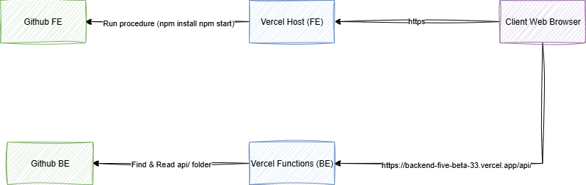

<p align="center">
  
</p>

# Website MBC Laboratory oleh Veiron Vaya Yarief

# [<-- Kembali pilih bahasa](../../Readme.md)
# Daftar Isi

- [Website MBC Laboratory oleh Veiron Vaya Yarief](#website-mbc-laboratory-oleh-veiron-vaya-yarief)
- [\<-- Kembali pilih bahasa](#---kembali-pilih-bahasa)
- [Daftar Isi](#daftar-isi)
  - [1. Struktur Proyek](#1-struktur-proyek)
  - [2. Akses (Cloud \& Lokal) Tutorial](#2-akses-cloud--lokal-tutorial)
    - [2.1. Cloud](#21-cloud)
    - [2.2. Instalasi Lokal](#22-instalasi-lokal)
  - [3. Arsitektur Website](#3-arsitektur-website)
  - [4. Konfigurasi SSL dan Backend](#4-konfigurasi-ssl-dan-backend)
    - [4.1. Keamanan Backend](#41-keamanan-backend)
    - [4.2. Keamanan Frontend](#42-keamanan-frontend)
    - [4.3. Penjelasan](#43-penjelasan)
  - [5. Fitur (Form Kontak)](#5-fitur-form-kontak)
    - [Contoh Alur](#contoh-alur)
  - [6. Konfigurasi \& Keamanan IDS](#6-konfigurasi--keamanan-ids)
    - [6.1. ids-rules.json](#61-ids-rulesjson)
    - [6.2. ids.config.js](#62-idsconfigjs)
    - [6.3. api/contact.js (Pemindaian IDS)](#63-apicontactjs-pemindaian-ids)

## 1. Struktur Proyek

```
MBC_LABORATORY_WEBSITE/
├── backend/
│   ├── api/                         # Vercel otomatis membaca "api"
│   ├── .env                         # Variabel lingkungan untuk backend
│   ├── ids-rules.json               # Aturan khusus IDS
│   ├── ids.config.js                # Konfigurasi khusus IDS
│
├── frontend/                        # UI berbasis React
│   ├── src/
│   │   ├── assets/                  # Aset lokal untuk frontend seperti logo dan gambar
│   │   ├── components/              # Komponen UI yang dapat digunakan kembali
│   │   ├── controllers/             # File logika yang menggunakan layanan
│   │   ├── layouts/                 # Layout UI untuk elemen yang selalu tampil seperti topnavbar
│   │   ├── pages/                   # UI halaman
│   │   ├── routes/                  # Definisi React Router
│   │   ├── services/                # Pemanggilan API
│   │   ├── App.jsx                  # Terhubung dengan routes untuk merender app
│   │   ├── index.js                 # Titik masuk aplikasi frontend -> App.jsx
│   │   ├── index.css                # Dari dokumentasi tailwind (Menambahkan @tailwind)
│   ├── .env                         # Variabel lingkungan untuk frontend
│   ├── tailwind.config.js           # Konfigurasi Tailwind
│
├── documentation                   # Dokumentasi proyek
│   ├── assets/                      # Gambar yang digunakan dalam dokumentasi
```

## 2. Akses (Cloud & Lokal) Tutorial

### 2.1. Cloud

1. Hubungkan ke Internet
2. Buka Browser
3. Kunjungi [https://mbc-lab-veiron.vercel.app/](https://mbc-lab-veiron.vercel.app/)

### 2.2. Instalasi Lokal

1. Buka terminal (pastikan sudah punya git) lalu jalankan `git clone https://github.com/VeironVaya/mbc_laboratory_website.git`
2. Masuk ke folder `./frontend`
3. Jalankan `npm install`
4. Jalankan `npm start`

## 3. Arsitektur Website



Diagram ini mungkin terlihat sederhana karena Vercel menyederhanakan banyak hal, contohnya lapisan jaringan ditangani oleh Vercel. Berikut penjelasan menurut pemahaman saya:

1. Vercel FE akan mengambil kode dari repo github dengan perintah yang saya set sebelumnya `npm run build` dengan output `build` dan `npm install`
2. Vercel BE akan mengambil kode dari repo github dan secara otomatis membaca folder `api/`
3. Di dalam Vercel akan menangani sistem cloud dan mengatur sertifikat secara otomatis
4. **\[UNIK]** dalam gambar saya, client berkomunikasi dengan Vercel FE dan Vercel BE secara langsung karena saya menggunakan React.js yang berbasis CSR, artinya ketika aplikasi diakses maka akan mendapatkan file dari frontend dan langsung berkomunikasi dengan BE.

## 4. Konfigurasi SSL dan Backend

### 4.1. Keamanan Backend 


### 4.2. Keamanan Frontend


### 4.3. Penjelasan

Dari [dokumentasi vercel](https://vercel.com/docs/domains/working-with-ssl) "Sertifikat SSL dikeluarkan dari certificate authority (CA) untuk setiap domain. Meskipun memungkinkan untuk membuat dan mengunggah sertifikat kustom, Vercel akan secara otomatis mencoba menghasilkan sertifikat untuk setiap domain setelah ditambahkan ke proyek, terlepas dari apakah domain tersebut didaftarkan melalui Vercel atau tidak. Namun, itu hanya akan berfungsi setelah permintaan validasi sertifikat berhasil, yang terjadi setelah DNS ditambahkan dan dipropagasi."

Jadi sertifikat SSL diatur otomatis oleh Vercel ketika saya deploy, website ini dideploy melalui Vercel dengan langkah berikut:

1. Push kode ke github repository
2. Install Vercel di Github Repository (mengikuti setup Vercel)
3. Di dashboard Vercel tambahkan project baru untuk dideploy
4. Deploy backend dan frontend (dalam project terpisah)

   * Untuk backend saya set environment di Vercel dengan SMTP EMAIL & SMTP PASS
   * Untuk frontend saya set environment dengan REACT\_APP\_API\_BASE untuk koneksi ke backend
5. Domain langsung menggunakan HTTPS

## 5. Fitur (Form Kontak)

1. **Input & Validasi Pengguna**

   * Pengguna mengisi form kontak di UI.
   * Frontend menjalankan validasi dasar (misal regex untuk email, nomor telepon, dll.) sebelum tombol "Submit" bisa diklik.

2. **Kirim & Panggil API**

   * Saat tombol **Submit** diklik, frontend memanggil endpoint backend melalui:

     ```
     https://backend-five-beta-33.vercel.app/api/contact
     ```
   * URL ini bekerja karena di Vercel semua file dalam `/api` otomatis diekspos sebagai fungsi serverless.

3. **CORS**

   * Cross-Origin Resource Sharing (CORS) diaktifkan agar React app (origin A) dapat memanggil backend (origin B).

4. **Validasi Backend (Aturan IDS)**

   * Fungsi serverless menerapkan pemeriksaan regex IDS (Input Detection System) dan rate limit.
   * Jika payload gagal pemeriksaan, permintaan akan ditolak dengan error.

5. **Pengiriman Email**

   * Jika lolos validasi, backend menggunakan kredensial SMTP (dari environment Vercel) untuk mengirim pesan ke email tujuan.

6. **Penanganan Respons**

   * API mengembalikan respons JSON yang menyatakan berhasil atau gagal.
   * Frontend menampilkan pesan konfirmasi atau notifikasi error berdasarkan respons tersebut.

---

### Contoh Alur

1. Pengguna mengisi **Nama**, **Email**, dan **Pesan**.
2. Frontend memverifikasi `email.match(/…/)` dan input tidak kosong.
3. Pengguna klik **Submit** → `api.sendContact(data)` di `services/api.js`.
4. Browser melakukan POST ke `/api/contact`.
5. Fungsi serverless memvalidasi lagi, lalu memanggil Nodemailer.
6. Pengguna melihat “Berhasil mengirim pesan".

## 6. Konfigurasi & Keamanan IDS

### 6.1. ids-rules.json

| Field   | Tipe    | Deskripsi                                                     |
| ------- | ------- | ------------------------------------------------------------- |
| `id`    | integer | ID numerik unik untuk aturan tersebut.                        |
| `name`  | string  | Deskripsi aturan dalam format yang mudah dibaca manusia.      |
| `regex` | string  | Pola yang digunakan untuk mendeteksi, dalam bentuk string JS. |
| `flags` | string  | Flag regex (misal: "i" untuk case-insensitive).               |

```json
[
  {
    "id": 1001,
    "name": "XSS <script>",
    "regex": "<script.*?>",
    "flags": "i"
  },
  {
    "id": 1002,
    "name": "SQL Injection keywords",
    "regex": "\\b(union|select|drop)\\b",
    "flags": "i"
  },
  {
    "id": 1003,
    "name": "Directory traversal",
    "regex": "\\.\\./+",
    "flags": ""
  }
]
```

1. Aturan 1001

   * Mendeteksi tag `<script>` (case-insensitive).
   * Memblokir injeksi JavaScript inline.
2. Aturan 1002

   * Menangkap kata kunci SQL seperti UNION, SELECT, DROP.
   * Mencegah serangan SQL injection dasar dalam input user.
3. Aturan 1003

   * Mendeteksi pola `../`
   * Menghentikan upaya traversal direktori.

### 6.2. ids.config.js

Memuat aturan dan mengatur opsi global IDS untuk lingkungan Node:

```js
const IDS_OPTIONS = {
  blockOnMatch: true,    // langsung tolak request jika ada kecocokan
  logSnippetLen: 200     // berapa banyak karakter payload yang ditampilkan dalam log
};

const rules = [
  {
    id: 1001,
    name: "XSS <script>",
    regex: /<script.*?>/i
  },
  {
    id: 1002,
    name: "SQL Injection keywords",
    regex: /\b(union|select|drop)\b/i
  },
  {
    id: 1003,
    name: "Directory traversal",
    regex: /\.\.\/+/
  }
];

module.exports = { rules, IDS_OPTIONS };
```

1. blockOnMatch: true (Langsung blokir request jika ada kecocokan)
2. logSnippetLen: 200 (Mencatat hingga 200 karakter dari payload untuk log)
3. Array rules (Sama seperti ids-rules.json, tetapi regex dikompilasi ke objek RegExp)

### 6.3. api/contact.js (Pemindaian IDS)

```js
const { rules, IDS_OPTIONS } = require('../ids.config');
const fetch = (...args) => import('node-fetch').then(({ default: fetch }) => fetch(...args));

module.exports = async (req, res) => {
  // 1. Penanganan preflight CORS…
  if (req.method === 'OPTIONS') { /* … */ }

  // 2. Hanya izinkan POST
  if (req.method !== 'POST') { /* … */ }

  const { name = '', email = '', subject = '', message = '' } = req.body;
  const payload = `${name}${subject}${message}`;

  // 3. Loop pemindaian IDS
  for (const { id, name: ruleName, regex } of rules) {
    if (regex.test(payload)) {
      // 3a. Catat peringatan
      const snippet = payload.slice(0, IDS_OPTIONS.logSnippetLen);
      console.warn(`🛡️ [IDS:${id}] ${ruleName}`, { snippet });

      // 3b. (Opsional) Kirim ke webhook alert
      if (process.env.IDS_ALERT_WEBHOOK) {
        fetch(process.env.IDS_ALERT_WEBHOOK, { /* … */ }).catch(console.error);
      }

      // 3c. Blokir atau lanjut berdasarkan config
      const shouldBlock = process.env.IDS_BLOCK === 'true' || IDS_OPTIONS.blockOnMatch;
      if (shouldBlock) {
        return res
          .status(400)
          .json({ success: false, error: `Diblokir oleh aturan IDS: ${ruleName}` });
      }
    }
  }

  // 4. Jika lolos semua aturan IDS, lanjut kirim email…
  //    (nodemailer transport, sendMail, dll.)
};
```

1. Rakit payload: Gabungkan semua field input user (nama, subject, pesan) jadi satu string.
2. Uji tiap aturan: Loop melalui aturan; jalankan regex.test(payload).
3. Jika cocok: Tampilkan log peringatan, kirim ke webhook jika diset, blokir request (400 Bad Request).
4. Jika tidak ada aturan yang aktif: Lanjutkan pengiriman email seperti biasa.
